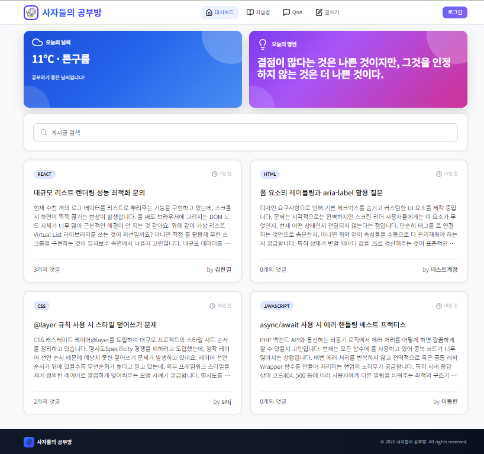
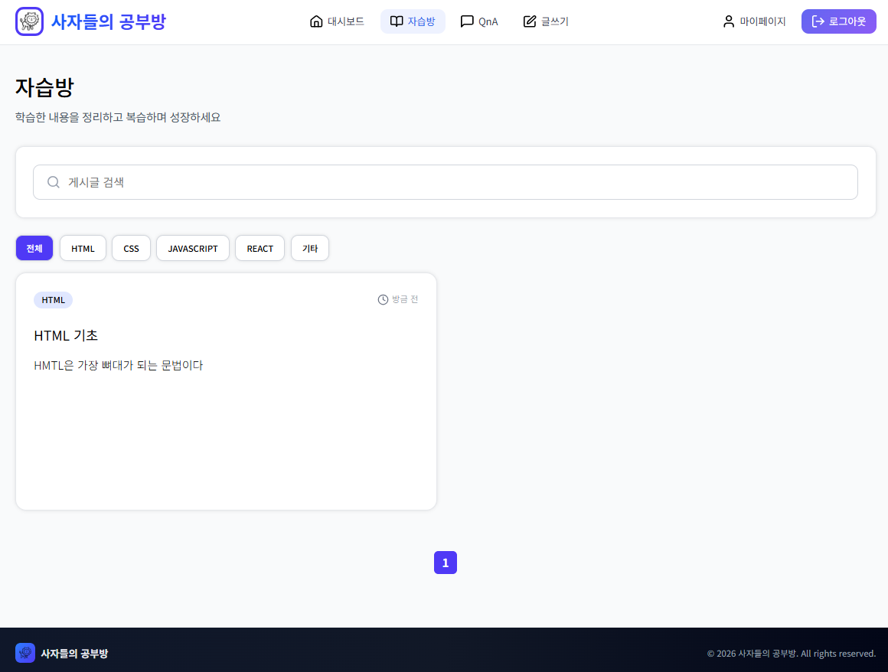
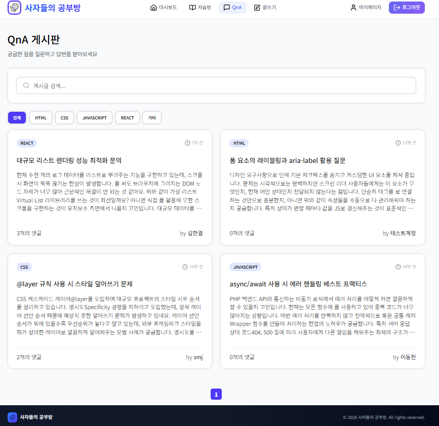
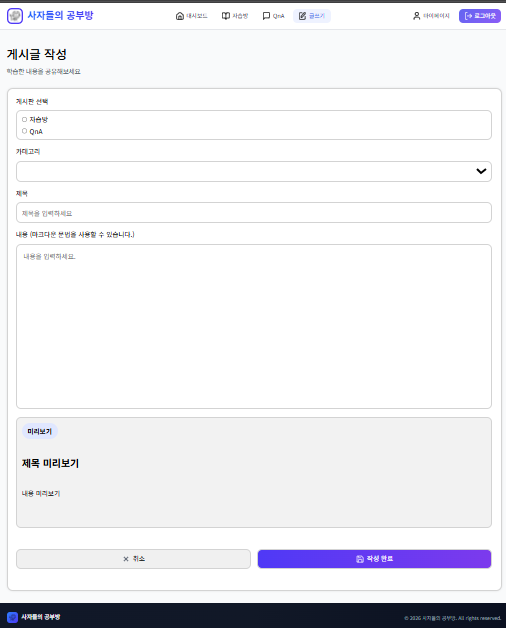
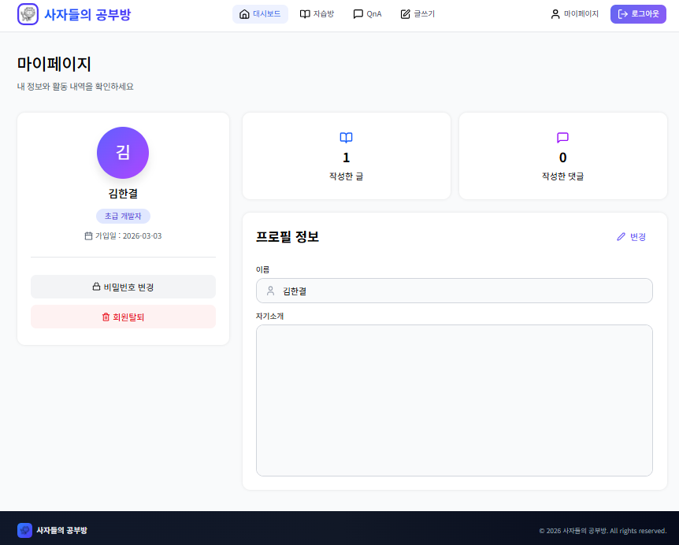

# 🦁Lion Study Room

조장 : 김한결  
조원 : 김효경, 사민재, 이동헌

## 🏷️주제

스터디 참여자들이 학습 현황을 확인하고,  
질문(QnA)과 게시글 작성을 통해 소통할 수 있는 바닐라 JavaScript 기반 학습 커뮤니티 웹 서비스입니다.

## 🔗 Demo

- 배포 주소 : http://leedh9207.dothome.co.kr/
  (http로 접속해야합니다)
- 개발 서버 : http://localhost:3000

## 🚀 실행 방법

git clone https://github.com/FRONTENDBOOTCAMP-16th/vanilla-project-team2.git  
cd vanilla-project-team2  
bun install  
bun run dev

## 🧰 개발 환경 (Development Environment)

| 구분                 | 내용               |
| -------------------- | ------------------ |
| Editor               | Visual Studio Code |
| Runtime / Build Tool | dothome            |
| Package Manager      | bun                |
| Version Control      | Git / GitHub       |

## 🧩 기술 스택 (Tech Stack)

| 영역     | 기술                    |
| -------- | ----------------------- |
| Frontend | HTML5, CSS3, JavaScript |
| Backend  | PHP                     |
| Database | MySQL                   |

## ⚙️ 주요 구현 내용


📊 대시보드

- 공통 Header / Footer 레이아웃 적용으로 모든 페이지에서 동일한 UI 제공
- 외부 API(날씨, 명언)를 활용한 정보 카드 표시
- QnA 게시글 최신 목록 요약 제공
- 사용자 상태를 확인할 수 있는 메인 화면 구성

📚 자습방 (개인 학습자료실)

- 개인 학습자료 등록 / 수정 / 삭제 기능
- 카테고리(메뉴)별 자료 관리
- 작성한 자료 목록 조회

💬 QnA (공동 학습자료실)

- 질문 게시글 등록 / 수정 / 삭제 기능
- 전체 사용자 게시글 목록 조회
- 게시글 상세 조회 기능
- 페이지 이동 후에도 목록 상태 유지

👤 회원 서비스

- 회원가입 시 입력값 검증 및 계정 생성 처리
- 로그인 시 사용자 인증 상태 저장(localStorage) 및 UI 반영
- 로그아웃 시 인증 정보 제거 및 메뉴 초기화
- 회원정보 조회 및 수정 기능 제공
- 회원 탈퇴 시 계정 정보 삭제 처리
- 로그인 상태에 따라 접근 가능한 페이지 제한 처리

## 📸 Screenshots

### 🏷️ 대시보드 


### 🏷️ 자습방 


### 🏷️ QnA 


### 🏷️ 글쓰기 


### 🏷️ 회원 서비스


## 🗂️ 파일구조

```
├── public/                     # 정적 파일 (favicon, 공개 이미지 등)
├── src/
│   ├── assets/                 # 프로젝트 공용 이미지/아이콘
│   ├── components/             # ✅ HTML 공통 컴포넌트
│   │   └── component.html      # (예: navbar / footer / modal 등 공통 HTML)
│   ├── js/                     # 공통 JS 로직
│   │   ├── core/               # 상태/스토리지/API
│   │   ├── utils/              # 유틸 함수
│   │   ├── components/         # (선택) 컴포넌트 관련 JS
│   │   └── main.js             # 공통 초기화
│   ├── pages/                  # 페이지 단위 리소스
│   │   ├── dashboard/
│   │   │   └── index.html
│   │   ├── login/
│   │   │   └── index.html
│   │   ├── mypage/
│   │   │   └── index.html
│   │   ├── qna/
│   │   │   └── index.html
│   │   ├── signup/
│   │   │   ├── index.html
│   │   │   ├── signup.css
│   │   │   └── signup.page.js
│   │   └── studyroom/
│   │       ├── studyroom.html
│   │       ├── studyroom.css
│   │       └── studyroom.page.js
│   └── styles/                 # 전역 스타일
│       ├─ base.css             #reset, font, body 기본값
│       ├─ layout.css           #header/footer/nav/컨테이너
│       └── components.css      # 버튼, 카드, 배지, 모달
├── index.html
├── vite.config.mjs
├── package.json
└── README.md

```

## 🌐 외부 API

- 날씨 API https://openweathermap.org/api 
- 명언 API https://korean-advice-open-api.vercel.app/api/advice


## 🎈일정관리

- WBS
  https://docs.google.com/spreadsheets/d/1HwL7cM-AJQ6OmhCfo0MxOArtg63HtGmF2DU0CgpEd84/edit?gid=0#gid=0

## 🧩 Troubleshooting

1️⃣fetch로 불러온 HTML에서 이벤트가 동작하지 않던 문제

문제 : 동적으로 불러온 Header의 로그아웃 버튼 클릭 이벤트가 동작하지 않음  
원인 : 이벤트 리스너가 DOM 삽입 이전에 등록되어 실제 요소에 바인딩되지 않음  
해결 : 레이아웃 삽입 후 이벤트를 연결하도록 수정하고, 공통 이벤트 바인딩 함수를 별도로 구성

2️⃣글 읽기 페이지에서 마크다운이 일부 사라져 보이는 오류

문제 : 글 쓰기 페이지에선 잘 렌더링되던 마크다운 문법이글 읽기 페이지에선 일부 코드가 사라져 보임.
원인 : 클래스를 주어 스타일을 준 `<pre><code>...</code></pre>` 코드가 marked 라이브러리를 적용하면서 클래스가 없는 `<pre><code>` 태그로 덮어씌워 지면서 스타일이 사라짐. 이 때 marked 라이브러리의 기본 renderer를 템플릿 리터럴로 커스터마이징 하면서 DOMPurify와 충돌하여 일부 코드를 지움. 
해결 : renderer를 커스터마이징 하지 않고, 렌더링 후 'pre'요소를 찾아 클래스만 추가하여 스타일 적용하는 방식으로 수정.

3️⃣ 로그인 무한루프와 마이페이지 성능 개선

문제 : JWT 토큰 검증이 무한루프 되어서 로딩이 걸리는 문제와 기존 fetch를 여러번 써서 매 순간 검증이 되는 문제가 있었다.
해결 : 최대 회수 제한으로 재귀함수의 제한을 걸고, 또한 상태 업데이트 시, 서버에서 읽지 말고 토큰 검증으로 읽어오도록 수정

4️⃣ 페이지네이션 로직 버그

문제: 1페이지에서 이전 버튼 노출, 결과가 없을 시 불필요한 버튼 생성 및 -1, -2 등 불필요한 페이지 생성 등
원인: 하한선 제한 부재 및 데이터 없을 시 예외 처리 누락
해결: Math.max(1, 계산식)으로 하한선 고정, totalPages === 0일 때 페이지네이션 숨김 처리

📚 배운 점

- 김한결 : 공통 레이아웃을 동적으로 로딩하는 구조를 구현하며 브라우저의 렌더링 과정과 DOM 생성 타이밍을 이해하였습니다.
  또한 fetch를 활용한 비동기 처리 과정에서 발생한 렌더링 순서 문제를 해결하며 프론트엔드 동작 흐름을 프로젝트를 통해서 구현하면서 학습할 수 있었습니다.
- 사민재 : 기능이 정상적으로 동작하는 것처럼 보여도 경계값(Edge Case)을 고려하지 않으면 예상치 못한 버그가 발생할 수 있다는 것을 배웠습니다. 데이터가 없거나 첫 페이지, 마지막 페이지와 같은 극단적인 상황을 항상 고려하여 Math.max, Math.min 같은 방어 코드를 습관적으로 작성하는 것이 중요하다는 것을 깨달았습니다.
- 이동헌 : 백엔드 로직과 그것을 통해 다른 조원들과의 백엔드 API 및 해당 이용에 대해 유익한 과제였던 것 같습니다. 또한 재귀함수 호출에 대해 배울 수 있었지만, 무한루프라는 문제점도 있기에 이것도 개선하는 방식에 대한 고민도 같이 할 수 있었던 큰 프로젝트 같았습니다. 해당 로직을 통해 다음 프로젝트에서도 잘 이용할 수 있고 또한 fetch 등 자바스크립트 베이직 실력이 많이 상승했음을 느낄 수 있었습니다.
- 김효경 : 여러개의 기능들이 물려있는 스파게티 코드가 추후 유지보수가 얼마나 어렵고 비효율적인지 깨닫는 시간이었습니다.
  추후에 정리하는 것보다 초반 부터 단일 책임으로 이루어진 코드를 짜서 순차적으로 실행시키는 편이 훨씬 시각적으로도 기능적으로도 깔끔하다는 것을 학습했습니다. 


## 📄 라이선스

본 프로젝트는 학습 및 포트폴리오 목적으로 제작되었습니다.
